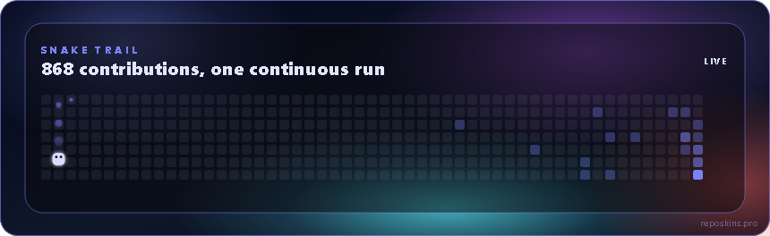

# RepoSkins

Generate animated GitHub profile cards — hero, wordmark, contribution heatmap,
ASCII portrait, chess, system scan, highlights, social row, snake trail —
plus social badges. Runs **100% on your machine**. The only services this
project ever talks to are `api.github.com` (your data, your token) and
`img.shields.io` (badge images). No shared backend, no rate limit shared
with anyone else, no GitHub Actions required, no account needed on our end.

<div align="center">


</div>

## Why

Most GitHub-profile generators run behind one shared API. That means one
rate limit for everyone, one outage taking down every profile that depends on
it, and no way to know your data isn't cached somewhere else. RepoSkins
Master Kit flips that: you run the generator, with your own GitHub token,
and commit the output straight into your own profile repo. Nothing to keep
running, nothing to depend on afterwards.

## What you get, free

- **2 themes**: `midnight` and `github-dark` — pixel-matched, fully themed
  across every card below. (21 themes total exist in the paid
  [reposkins.pro](https://reposkins.pro) hosted version, if you'd rather not
  run anything locally.)
- **8 cards**: hero, wordmark, heatmap, portrait, chess, system-scan,
  highlights, social-row
- **Bonus card — Snake Trail**: an animated contribution-grid card with a
  real snake trail, `midnight` theme only (see below)
- **Social badges**: shields.io badges built with zero API calls

## Screenshots

Real output for [github.com/leonardoborgesdev](https://github.com/leonardoborgesdev), theme `midnight` — this is what his actual profile README renders, stacked the same way, one card per row.

<div align="center">





</div>

<details>
<summary>More cards available in the kit (not used on the profile above, but included)</summary>

<div align="center">


</div>

</details>

## Quickstart

```bash
git clone https://github.com/leonardoborgesdev/reposkins.git
cd reposkins
pip install -r requirements.txt

export GITHUB_TOKEN=$(gh auth token)   # or a classic PAT, "repo" scope
python generate.py YOUR_USERNAME --theme midnight
```

This writes SVGs to `assets/` and a ready-to-paste `README.generated.md`.
From there:

1. Create a repo named exactly `YOUR_USERNAME/YOUR_USERNAME` **through the
   GitHub web UI** (not the API), with "Add a README file" checked — this is
   what activates GitHub's special profile display.
2. Copy `assets/` into the repo root, and `README.generated.md` into
   `README.md`.
3. Commit, push. Done — nothing left running anywhere.

### Adding the Snake Trail card

```bash
python generate.py YOUR_USERNAME --theme midnight --cards hero,wordmark,snake-trail
```

`snake-trail` is a static SVG like every other card — no GitHub Actions
workflow, no separate `output` branch, nothing to run on a schedule. It's
listed separately from the 8 free cards because the real template it's built
from only exists in `midnight`; requesting it with `--theme github-dark`
still renders it in midnight colors (you'll see a note when that happens).

### Adding social badges

```bash
python generate.py YOUR_USERNAME --theme midnight \
  --badges "linkedin:https://linkedin.com/in/you,instagram:https://instagram.com/you,email:you@example.com"
```

The LinkedIn shields.io logo only renders on brand color `#0A66C2` — this
kit already forces that color for the LinkedIn badge specifically, regardless
of your chosen theme, so the icon never silently disappears.

## Full guided walkthrough

[`MASTER_PROMPT.md`](MASTER_PROMPT.md) is a copy-paste prompt for a fresh
Claude (or any coding assistant with shell access) session — it walks through
authentication, generation, the special-repo gotcha, and publishing,
checking in with you at each step instead of doing everything blind.

Prefer a PDF? Both are in [`docs/`](docs/), with real screenshots:

- [**Setup Guide**](docs/RepoSkins-Setup-Guide.pdf) — the manual walkthrough, phase by phase
- [**Master Prompt**](docs/RepoSkins-Master-Prompt.pdf) — the copy-paste prompt, plus known issues and dead ends already ruled out

## What's intentionally not in the free kit

`about`, `stats`, and `stack` cards aren't included yet — today they only
render pixel-perfect in the `midnight` theme even in the hosted version, and
we'd rather ship nothing than ship a card with the wrong colors. The 19
other themes, and full customization, live at
[reposkins.pro](https://reposkins.pro).

## License

MIT — see [LICENSE](LICENSE).
