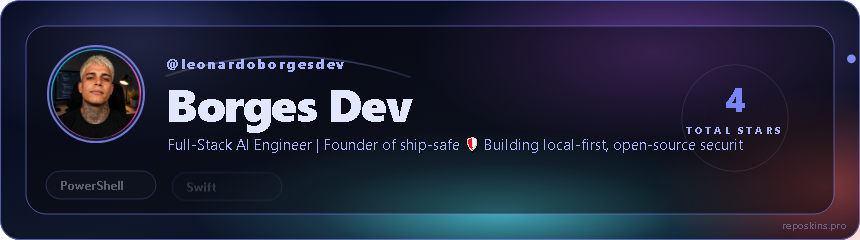
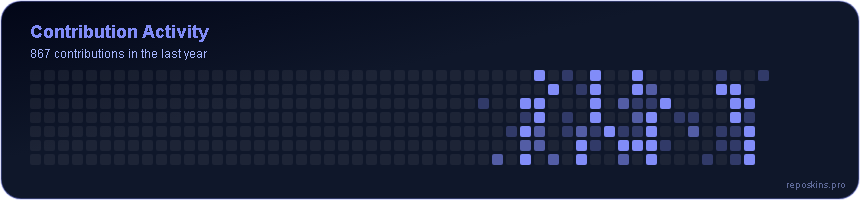
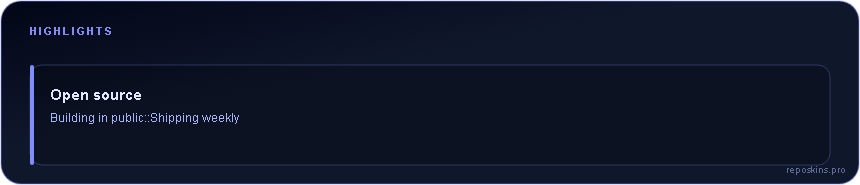
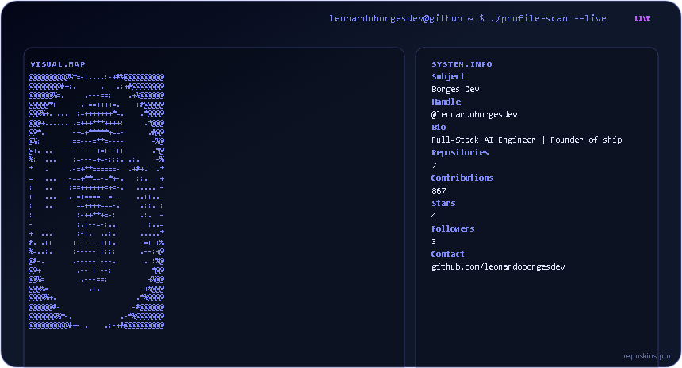
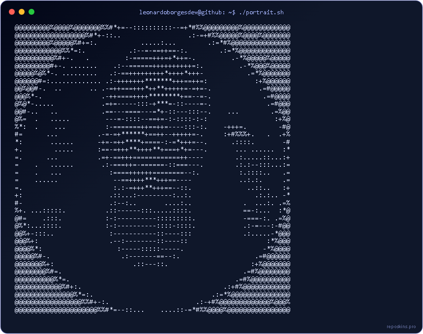

# RepoSkins

Generate animated GitHub profile cards — hero, wordmark, contribution heatmap,
ASCII portrait, chess, system scan, highlights, social row — plus a
contribution snake and social badges. Runs **100% on your machine**. The only
services this project ever talks to are `api.github.com` (your data, your
token), `img.shields.io` (badge images) and GitHub's own Actions runners for
the snake. No shared backend, no rate limit shared with anyone else, no
account required on our end.



## Why

Most GitHub-profile generators run behind one shared API. That means one
rate limit for everyone, one outage taking down every profile that depends on
it, and no way to know your data isn't cached somewhere else. RepoSkins
Master Kit flips that: you run the generator, with your own GitHub token,
and commit the output straight into your own profile repo. Nothing to keep
running, nothing to depend on afterwards.

## What you get, free

- **2 themes**: `midnight` and `github-dark` — pixel-matched, fully themed
  across every card below. (21 themes total exist in the paid
  [reposkins.pro](https://reposkins.pro) hosted version, if you'd rather not
  run anything locally.)
- **8 cards**: hero, wordmark, heatmap, portrait, chess, system-scan,
  highlights, social-row
- **Contribution snake**: a ready [`Platane/snk`](https://github.com/Platane/snk)
  GitHub Actions workflow, dark/light themed
- **Social badges**: shields.io badges built with zero API calls

## Screenshots

| | |
|---|---|
|  |  |
|  |  |
|  |  |

<details>
<summary>Portrait &amp; Chess (larger cards)</summary>




</details>

All generated from a real profile with real data — nothing here is a mockup.

## Quickstart

```bash
git clone https://github.com/leonardoborgesdev/reposkins.git
cd reposkins
pip install -r requirements.txt

export GITHUB_TOKEN=$(gh auth token)   # or a classic PAT, "repo" scope
python generate.py YOUR_USERNAME --theme midnight
```

This writes SVGs to `assets/` and a ready-to-paste `README.generated.md`.
From there:

1. Create a repo named exactly `YOUR_USERNAME/YOUR_USERNAME` **through the
   GitHub web UI** (not the API), with "Add a README file" checked — this is
   what activates GitHub's special profile display.
2. Copy `assets/` into the repo root, and `README.generated.md` into
   `README.md`.
3. Commit, push. Done — nothing left running anywhere.

### Adding the contribution snake

```bash
python generate.py YOUR_USERNAME --theme midnight --with-snake
```

Then copy `github-actions/snake-midnight.yml` (or `-github-dark.yml`) into
`.github/workflows/snake.yml` in your profile repo, set **Settings → Actions →
General → Workflow permissions → Read and write** on that repo, and run the
workflow once manually. The `output` branch — and the snake — only exist
after that first run.

### Adding social badges

```bash
python generate.py YOUR_USERNAME --theme midnight \
  --badges "linkedin:https://linkedin.com/in/you,instagram:https://instagram.com/you,email:you@example.com"
```

The LinkedIn shields.io logo only renders on brand color `#0A66C2` — this
kit already forces that color for the LinkedIn badge specifically, regardless
of your chosen theme, so the icon never silently disappears.

## Full guided walkthrough

[`MASTER_PROMPT.md`](MASTER_PROMPT.md) is a copy-paste prompt for a fresh
Claude (or any coding assistant with shell access) session — it walks through
authentication, generation, the special-repo gotcha, and publishing,
checking in with you at each step instead of doing everything blind.

## What's intentionally not in the free kit

`about`, `stats`, and `stack` cards aren't included yet — today they only
render pixel-perfect in the `midnight` theme even in the hosted version, and
we'd rather ship nothing than ship a card with the wrong colors. The 19
other themes, and full customization, live at
[reposkins.pro](https://reposkins.pro).

## License

MIT — see [LICENSE](LICENSE).
